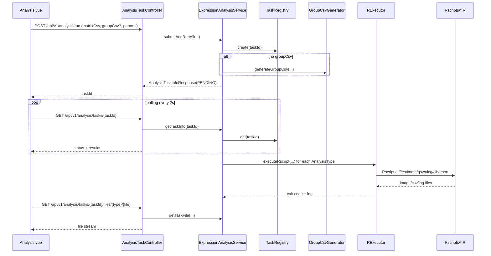
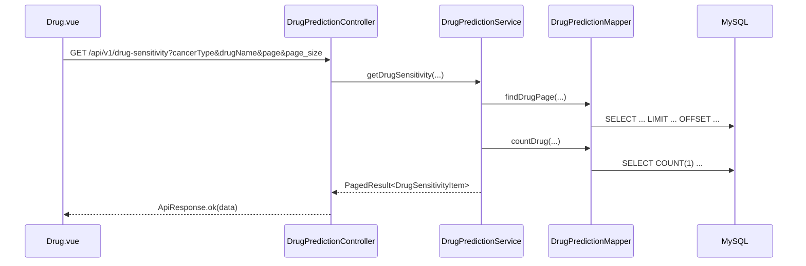

# DODA 后端逐文件逐函数详解（含前后端交互）

## 1. 阅读说明

本文覆盖 `backend/doda/src/main/java` 下全部主代码文件，并补充前端调用点（`frontend/doda/src/views/Analysis.vue`、`frontend/doda/src/views/Drug.vue`）。

每个函数按以下维度说明：

1. 职责：这个函数做什么。
2. 入参/出参：关键参数与返回值。
3. 调用谁：本函数内部依赖的核心函数。
4. 被谁调用：外部入口或上层函数。
5. 前端关系：是否由前端直接触发。

---

## 2. 全局调用图（先看这个）

### 2.1 分析任务链路

### 2.2 药敏检索链路

---

## 3. 后端逐文件逐函数说明

## 3.1 `com/example/doda/DodaApplication.java`

### 函数 1：`main(String[] args)`

1. 职责：Spring Boot 应用入口。
2. 入参/出参：入参 `String[] args`，无返回值。
3. 调用谁：`SpringApplication.run(...)`。
4. 被谁调用：JVM 启动时调用。
5. 前端关系：无直接关系。

### 函数 2：`corsConfigurer()`

1. 职责：注册全局 CORS 配置 Bean。
2. 入参/出参：无入参，返回 `WebMvcConfigurer`。
3. 调用谁：匿名类中的 `addCorsMappings`。
4. 被谁调用：Spring 容器在启动时装配。
5. 前端关系：前端能跨域访问后端接口（当前 `allowedOrigins("*")`）。

### 函数 3：`addCorsMappings(CorsRegistry registry)`（匿名内部类 override）

1. 职责：配置 `/**` 全路径 CORS。
2. 入参/出参：入参 `CorsRegistry`，无返回值。
3. 调用谁：`registry.addMapping("/**").allowedOrigins("*")`。
4. 被谁调用：Spring MVC 初始化时触发。
5. 前端关系：允许 `localhost:8080` 调用 `localhost:8081`。

---

## 3.2 `com/example/doda/controller/DrugPredictionController.java`

### 构造函数：`DrugPredictionController(DrugPredictionService drugPredictionService)`

1. 职责：注入业务服务层。
2. 调用谁：无。
3. 被谁调用：Spring IOC 容器。

### 函数 1：`getDrugPredictions(String cancerType, String drugName)`

1. 职责：旧版药敏查询接口，不分页。
2. 入参/出参：癌种+药名关键字，返回 `List<DrugPrediction>`。
3. 调用谁：`drugPredictionService.getPredictions(...)`。
4. 被谁调用：HTTP `GET /api/drug-predictions`。
5. 前端关系：当前前端主流程未使用此接口。

### 函数 2：`getDrugSensitivity(String cancerType, String drugName, int page, int pageSize)`

1. 职责：新版分页接口。
2. 入参/出参：查询条件 + 分页参数，返回 `ApiResponse<PagedResult<DrugSensitivityItem>>`。
3. 调用谁：
   1. `Math.max/Math.min` 做分页参数保护。
   2. `drugPredictionService.getDrugSensitivity(...)`。
   3. `ApiResponse.ok(data)` 封装统一返回。
4. 被谁调用：HTTP `GET /api/v1/drug-sensitivity`。
5. 前端关系：`Drug.vue` 的 `fetchTableData()` 直接调用。

---

## 3.3 `com/example/doda/service/DrugPredictionService.java`

### 构造函数：`DrugPredictionService(DrugPredictionMapper drugPredictionMapper)`

1. 职责：注入 Mapper。
2. 被谁调用：Spring IOC。

### 函数 1：`getPredictions(String cancerType, String drugName)`

1. 职责：旧版不分页查询。
2. 入参/出参：条件 -> `List<DrugPrediction>`。
3. 调用谁：
   1. `normalizeKeyword(drugName)`。
   2. `drugPredictionMapper.findDrug(...)`。
4. 被谁调用：`DrugPredictionController.getDrugPredictions()`。
5. 前端关系：当前主流程未调用。

### 函数 2：`getDrugSensitivity(String cancerType, String drugName, int page, int pageSize)`

1. 职责：分页查询主函数。
2. 入参/出参：条件 + 分页 -> `PagedResult<DrugSensitivityItem>`。
3. 调用谁：
   1. `normalizeKeyword(...)`。
   2. `drugPredictionMapper.findDrugPage(...)`（取当前页）。
   3. `drugPredictionMapper.countDrug(...)`（取总数）。
   4. `stream().map(...)` 将 `DrugPrediction` 转换成 `DrugSensitivityItem`。
4. 被谁调用：`DrugPredictionController.getDrugSensitivity()`。
5. 前端关系：直接支撑 `Drug.vue` 表格 + 分页。

### 函数 3：`normalizeKeyword(String drugName)`

1. 职责：关键字清洗（null -> 空串，trim）。
2. 入参/出参：字符串 -> 字符串。
3. 调用谁：无。
4. 被谁调用：`getPredictions()`、`getDrugSensitivity()`。

---

## 3.4 `com/example/doda/mapper/DrugPredictionMapper.java`

> MyBatis 注解式 SQL，属于“函数声明 + SQL 模板”。

### 函数 1：`findDrugPage(String cancerType, String drugName, int offset, int limit)`

1. 职责：按癌种和药名模糊条件分页查询。
2. 返回：`List<DrugPrediction>`。
3. SQL 关键点：
   1. `WHERE cancerType = #{cancerType}`。
   2. 可选 `LOWER(drugName) LIKE ...`。
   3. `LIMIT #{limit} OFFSET #{offset}`。
4. 被谁调用：`DrugPredictionService.getDrugSensitivity()`。

### 函数 2：`countDrug(String cancerType, String drugName)`

1. 职责：统计总条数。
2. 返回：`long`。
3. 被谁调用：`DrugPredictionService.getDrugSensitivity()`。

### 函数 3：`findDrug(String cancerType, String drugName)`

1. 职责：旧版全量查询。
2. 返回：`List<DrugPrediction>`。
3. 被谁调用：`DrugPredictionService.getPredictions()`。

---

## 3.5 `com/example/doda/analysis/AnalysisTaskController.java`

### 构造函数：`AnalysisTaskController(ExpressionAnalysisService analysisService)`

1. 职责：注入分析服务。
2. 被谁调用：Spring IOC。

### 函数 1：`run(MultipartFile matrixCsv, MultipartFile groupCsv, String groupStrategy, Double logfc, Double padj)`

1. 职责：分析任务提交入口。
2. 入参/出参：
   1. 入参：表达矩阵文件（必传）、分组文件（可选）、策略与阈值参数。
   2. 出参：`AnalysisTaskInfoResponse`（立即返回 PENDING）。
3. 调用谁：
   1. 解析 `groupStrategy` 到 `GroupStrategy` 枚举。
   2. `analysisService.submitAndRunAll(...)`。
4. 被谁调用：前端 `Analysis.vue/runAnalysis()`。
5. 前端关系：这是分析页面主入口 API。

### 函数 2：`taskInfo(String taskId)`

1. 职责：查询任务状态和结果文件信息。
2. 入参/出参：`taskId` -> `AnalysisTaskInfoResponse`。
3. 调用谁：`analysisService.getTaskInfo(taskId)`。
4. 被谁调用：前端轮询。
5. 前端关系：`Analysis.vue` 中 `setInterval` 每 2 秒请求。

### 函数 3：`getTaskFile(String taskId, String analysisTypeId, String filename)`

1. 职责：返回任务输出文件（图片/CSV）。
2. 入参/出参：任务标识 + 文件名 -> `ResponseEntity<FileSystemResource>`。
3. 调用谁：
   1. `analysisService.getTaskFile(...)` 获取合法文件对象。
   2. `Files.probeContentType(...)` 推断 MIME。
4. 被谁调用：前端展示图片、下载图表、读取 DEG CSV。
5. 前端关系：
   1. `getResultImageUrl(...)` 用于 ``。
   2. `loadDegGenesIfAvailable()` 读取 CSV 文本。

---

## 3.6 `com/example/doda/analysis/ExpressionAnalysisService.java`

### 构造函数：`ExpressionAnalysisService(...)`

1. 职责：初始化执行环境、线程池、路径与配置参数。
2. 入参/出参：大量 `@Value` 注入配置；无返回。
3. 调用谁：
   1. `resolveEngineRoot(...)`。
   2. `resolveWorkRoot(...)`。
   3. `Files.createDirectories(...)` 创建工作目录。
4. 被谁调用：Spring IOC。

### 函数 1：`shutdownExecutor()`

1. 职责：容器销毁前关闭线程池。
2. 调用谁：`executorService.shutdown()`。
3. 被谁调用：`@PreDestroy` 生命周期。

### 函数 2：`submitAndRunAll(...)`

1. 职责：分析总入口（提交 + 准备输入 + 异步派发）。
2. 入参/出参：
   1. 入参：矩阵文件、分组文件、策略、阈值。
   2. 出参：`AnalysisTaskInfoResponse`（`PENDING`）。
3. 调用谁：
   1. 参数校验与默认值处理。
   2. `registry.create(taskId)` 创建任务。
   3. `MultipartFile.transferTo(...)` 保存上传文件。
   4. 无分组时调用 `new GroupCsvGenerator().generateGroupCsv(...)`。
   5. `executorService.submit(...)` 提交异步执行。
   6. 异步线程内调用 `runAll(...)`。
4. 被谁调用：`AnalysisTaskController.run()`。
5. 前端关系：提交任务立即返回 taskId，供前端轮询。

### 函数 3：`runAll(...)`

1. 职责：按分析类型依次执行所有 R 脚本并收集结果。
2. 入参/出参：任务对象、输入文件、输出目录、阈值 -> `RunSummary`。
3. 调用谁：
   1. 创建 `RExecutor`。
   2. 枚举 `AnalysisType.values()`。
   3. `buildArgs(...)` 生成脚本参数。
   4. `getScriptFileName(...)` 定位脚本名。
   5. `executor.executeRscript(...)` 执行脚本。
   6. `detectResultFiles(...)` 探测结果文件。
4. 被谁调用：`submitAndRunAll()` 的异步线程。
5. 前端关系：决定最终可展示哪些分析结果。

### 函数 4：`buildArgs(...)`

1. 职责：按分析类型拼装 Rscript 参数顺序。
2. 关键点：不同脚本参数差异在这里统一管理。
3. 被谁调用：`runAll()`。

### 函数 5：`getScriptFileName(AnalysisType type)`

1. 职责：分析类型 -> R 脚本文件名映射。
2. 被谁调用：`runAll()`。

### 函数 6：`getTaskInfo(String taskId)`

1. 职责：读取任务状态并构造响应 DTO。
2. 调用谁：`registry.get(taskId)`。
3. 被谁调用：`AnalysisTaskController.taskInfo()`。
4. 前端关系：轮询状态的数据源。

### 函数 7：`getTaskFile(String taskId, String analysisTypeId, String filename)`

1. 职责：在工作目录内安全定位文件。
2. 调用谁：
   1. `AnalysisType.fromId(...)` 校验类型。
   2. `Path.normalize()` + `target.startsWith(resultDir)` 防路径穿越。
3. 被谁调用：`AnalysisTaskController.getTaskFile()`。
4. 前端关系：图片/CSV 的真实文件解析。

### 函数 8：`detectResultFiles(AnalysisType type, Path outDir)`

1. 职责：自动识别某分析类型的图片/CSV结果文件名。
2. 调用谁：`imageCandidates(...)`、`csvCandidates(...)`、`resolveResultFileName(...)`。
3. 被谁调用：`runAll()`。

### 函数 9：`resolveResultFileName(...)`

1. 职责：优先按候选文件名匹配，找不到则按扩展名兜底。
2. 被谁调用：`detectResultFiles()`。

### 函数 10：`hasExtension(...)`

1. 职责：扩展名匹配工具函数。
2. 被谁调用：`resolveResultFileName()`。

### 函数 11：`imageCandidates(AnalysisType type)`

1. 职责：按类型给出图片候选名（含特例）。
2. 被谁调用：`detectResultFiles()`。

### 函数 12：`csvCandidates(AnalysisType type)`

1. 职责：按类型给出 CSV 候选名（含特例）。
2. 被谁调用：`detectResultFiles()`。

### 函数 13：`resolveEngineRoot(String configuredPath)`

1. 职责：从多个候选路径推断 R 引擎目录。
2. 被谁调用：构造函数。

### 函数 14：`resolveWorkRoot(String configuredPath)`

1. 职责：解析任务工作目录（支持相对/绝对路径）。
2. 被谁调用：构造函数。

### 函数 15：`safeMessage(Throwable throwable)`

1. 职责：提取异常可读信息（含 cause 递归兜底）。
2. 被谁调用：任务失败处理、`runAll()` 异常汇总。

### 内部类函数：`RunSummary.buildMessage()`

1. 职责：根据成功数和失败明细生成任务 message。
2. 被谁调用：`submitAndRunAll()` 异步流程。

---

## 3.7 `com/example/doda/analysis/RExecutor.java`

### 构造函数：`RExecutor(...)`

1. 职责：接收执行模式与环境参数。

### 函数 1：`execute(List<String> command, File logFile, long timeoutMs)`

1. 职责：执行外部命令并重定向日志。
2. 关键点：
   1. 支持超时等待。
   2. 超时后 `destroyForcibly()`。
3. 被谁调用：`executeRscript()`。

### 函数 2：`appendTimeoutLog(File logFile, long timeoutMs)`

1. 职责：向日志追加超时信息。
2. 被谁调用：`execute()`。

### 函数 3：`executeRscript(String scriptPath, List<String> scriptArgs, File logFile, long timeoutMs)`

1. 职责：按模式组装命令并执行 Rscript。
2. 逻辑分支：
   1. `wsl`：构造 `wsl bash -lc` 命令。
   2. `direct`：直接 `Rscript script args`。
   3. `auto/conda`：优先 `conda run -n env`，失败可回退 direct。
3. 被谁调用：`ExpressionAnalysisService.runAll()`。

### 函数 4：`toWslPath(String windowsPath)`

1. 职责：Windows 路径转 WSL 路径。
2. 被谁调用：`executeRscript()`。

### 函数 5：`toWslArg(String arg)`

1. 职责：参数转 WSL 形式（复用 `toWslPath`）。
2. 被谁调用：`executeRscript()`。

### 函数 6：`escapeSingleQuotes(String s)`

1. 职责：bash 单引号安全转义。
2. 被谁调用：`executeRscript()`。

---

## 3.8 `com/example/doda/analysis/GroupCsvGenerator.java`

### 函数 1：`generateGroupCsv(File matrixCsv, GroupStrategy strategy, File groupOutCsv)`

1. 职责：自动从表达矩阵生成分组文件。
2. 步骤：
   1. 读取 header，识别分隔符。
   2. 逐行计算每个样本平均表达分数。
   3. 根据策略（中位数/上四分位）划分 Tumor/Normal。
   4. 若某组样本不足，回退到 MEDIAN 策略；仍不足则抛错。
   5. 写出 `sample_id,group` CSV。
3. 被谁调用：`ExpressionAnalysisService.submitAndRunAll()`（当 groupCsv 未上传时）。

### 函数 2：`detectDelimiter(String headerLine)`

1. 职责：Tab 数量大于逗号时按 TSV 处理。
2. 被谁调用：`generateGroupCsv()`。

### 函数 3：`countChar(String s, char c)`

1. 职责：统计字符数。
2. 被谁调用：`detectDelimiter()`。

### 函数 4：`cleanCell(String cell)`

1. 职责：去空白、去首尾双引号、去 BOM。
2. 被谁调用：`generateGroupCsv()`。

### 函数 5：`split(String line, char delimiter)`

1. 职责：按分隔符切分文本。
2. 被谁调用：`generateGroupCsv()`。

### 函数 6：`assignTumor(double[] scores, GroupStrategy strategy)`

1. 职责：按阈值判断每个样本是否归为 Tumor。
2. 被谁调用：`generateGroupCsv()`。

### 函数 7：`percentile(double[] sorted, double p)`

1. 职责：线性插值分位数计算。
2. 被谁调用：`assignTumor()`。

---

## 3.9 `com/example/doda/analysis/TaskRegistry.java`

### 函数 1：`create(String taskId)`

1. 职责：创建任务并写入 `ConcurrentHashMap`。
2. 被谁调用：`ExpressionAnalysisService.submitAndRunAll()`。

### 函数 2：`get(String taskId)`

1. 职责：按 taskId 查询任务。
2. 被谁调用：`ExpressionAnalysisService.getTaskInfo()`、`getTaskFile()`。

---

## 3.10 `com/example/doda/analysis/AnalysisTask.java`

### 构造函数：`AnalysisTask(String taskId)`

1. 职责：初始化任务默认状态（PENDING、空 message、createdAt）。
2. 被谁调用：`TaskRegistry.create()`。

### 函数 1：`getTaskId()`

1. 职责：返回任务 ID。

### 函数 2：`getStatus()` / 函数 3：`setStatus(TaskStatus status)`

1. 职责：读写任务状态。
2. 被谁调用：`ExpressionAnalysisService` 异步执行流程。

### 函数 4：`getMessage()` / 函数 5：`setMessage(String message)`

1. 职责：读写任务说明信息（成功、失败、部分失败原因）。

### 函数 6：`getCreatedAt()`

1. 职责：返回创建时间。

### 函数 7：`getResultFiles()`

1. 职责：返回分析结果文件映射（typeId -> AnalysisFileInfo）。

### 函数 8：`setResultFile(String analysisTypeId, AnalysisFileInfo fileInfo)`

1. 职责：为某个分析类型写入结果文件信息。
2. 校验：typeId/fileInfo 为空时忽略。

---

## 3.11 `com/example/doda/analysis/AnalysisType.java`

### 枚举常量

1. `DEG`, `ESTIMATE`, `GSVA`, `IMMUNE_CHECKPOINT`, `CIBERSORT`。
2. 每项带 `id/title/defaultImageFile/defaultCsvFile`。

### 函数：`fromId(String id)`

1. 职责：字符串类型 ID 映射为枚举。
2. 被谁调用：`ExpressionAnalysisService.getTaskFile()`。

---

## 3.12 `com/example/doda/analysis/TaskStatus.java`

1. 枚举值：`PENDING`, `RUNNING`, `SUCCESS`, `FAILED`。
2. 被谁使用：`AnalysisTask`、`ExpressionAnalysisService`、`AnalysisTaskController`、`AnalysisTaskInfoResponse`。

---

## 3.13 `com/example/doda/analysis/GroupStrategy.java`

1. 枚举值：`MEDIAN`, `QUARTILE`。
2. 被谁使用：`AnalysisTaskController.run()`、`GroupCsvGenerator.assignTumor()`。

---

## 3.14 DTO 文件

## `analysis/dto/AnalysisTaskInfoResponse.java`

### 构造函数：`AnalysisTaskInfoResponse(...)`

1. 职责：封装任务对外响应。

### Getter 函数

1. `getTaskId()`。
2. `getStatus()`。
3. `getMessage()`。
4. `getCreatedAt()`。
5. `getResults()`。

## `analysis/dto/AnalysisFileInfo.java`

### 构造函数：`AnalysisFileInfo(String imageFile, String csvFile)`

1. 职责：封装单个分析类型的结果文件名。

### Getter 函数

1. `getImageFile()`。
2. `getCsvFile()`。

## `analysis/dto/AnalysisRunResponse.java`

### 构造函数：`AnalysisRunResponse(String taskId)`

1. 职责：仅封装 taskId（当前主流程未使用）。

### Getter 函数

1. `getTaskId()`。

---

## 3.15 Entity 文件

## `entity/ApiResponse.java`

### 构造函数：`ApiResponse(int code, String message, T data)`

1. 职责：统一 API 响应结构体。

### 函数：`ok(T data)`

1. 职责：快速构造成功响应（`code=0,message=ok`）。
2. 被谁调用：`DrugPredictionController.getDrugSensitivity()`。

### Getter 函数

1. `getCode()`。
2. `getMessage()`。
3. `getData()`。

## `entity/PagedResult.java`

### 构造函数：`PagedResult(List<T> items, long total, int page, int pageSize)`

1. 职责：分页响应体。

### Getter 函数

1. `getItems()`。
2. `getTotal()`。
3. `getPage()`。
4. `getPageSize()`。

## `entity/DrugPrediction.java`

### Getter/Setter（8 个）

1. `getSampleId()` / `setSampleId(...)`。
2. `getDrugName()` / `setDrugName(...)`。
3. `getSensitivityScore()` / `setSensitivityScore(...)`。
4. `getCancerType()` / `setCancerType(...)`。

说明：MyBatis 查询结果映射到该实体。

## `entity/DrugSensitivityItem.java`

### 构造函数：`DrugSensitivityItem(...)`

1. 职责：给前端返回 snake_case 字段（通过 `@JsonProperty`）。

### Getter（5 个）

1. `getSampleId()`。
2. `getDrugName()`。
3. `getSensitivityScore()`。
4. `getCancerType()`。
5. `getDataSource()`。

---

## 4. 前端如何和这些函数交互（逐函数映射）

## 4.1 `frontend/doda/src/views/Analysis.vue`

### 函数：`runAnalysis()`

1. 组装 `FormData`：`matrixCsv/groupCsv/groupStrategy/logfc/padj`。
2. 调用 `POST /api/v1/analysis/run`。
3. 保存 `taskId` 后启动轮询 `GET /api/v1/analysis/tasks/{taskId}`。
4. 状态为 `SUCCESS` 时读取 `info.results` 并加载 DEG CSV。
5. 对应后端函数：
   1. `AnalysisTaskController.run()`。
   2. `AnalysisTaskController.taskInfo()`。
   3. `ExpressionAnalysisService.submitAndRunAll()/getTaskInfo()`。

### 函数：`getResultImageUrl(typeId)`

1. 拼接文件访问 URL：`/api/v1/analysis/tasks/{taskId}/files/{typeId}/{filename}`。
2. 对应后端函数：`AnalysisTaskController.getTaskFile()` -> `ExpressionAnalysisService.getTaskFile()`。

### 函数：`loadDegGenesIfAvailable()`

1. 拉取 DEG CSV 文本并调用 `parseDegCsv(text)` 解析。
2. 对应后端函数：同上文件下载接口。

### 函数：`downloadChart(typeId)`

1. 通过 `<a download>` 下载后端文件 URL。

## 4.2 `frontend/doda/src/views/Drug.vue`

### 函数：`fetchTableData()`

1. 调用 `GET /api/v1/drug-sensitivity`，携带 `cancerType/drugName/page/page_size`。
2. 读取 `response.data.data.items` 和 `response.data.data.total`。
3. 对应后端函数：
   1. `DrugPredictionController.getDrugSensitivity()`。
   2. `DrugPredictionService.getDrugSensitivity()`。
   3. `DrugPredictionMapper.findDrugPage()/countDrug()`。

### 函数：`onKeywordInput()`

1. `setTimeout(350ms)` 防抖后调用 `fetchTableData()`。
2. 作用：减少后端检索压力。

### 函数：`handlePageChange(page)`

1. 切页后触发 `fetchTableData()`。

---

## 5. 连接关系总结（可直接用于答辩）

1. 前端不直接触达数据库和 R 脚本，只调用 Controller 接口。
2. Controller 不做重逻辑，只做参数接收和响应封装。
3. Service 才是核心编排层，负责任务生命周期、容错与结果聚合。
4. Mapper 仅负责 SQL，不掺杂业务判断。
5. RExecutor 将“如何跑脚本”的环境细节从业务逻辑中解耦。
6. TaskRegistry/AnalysisTask 负责跨请求保存任务状态（当前是内存态）。
7. Analysis.vue 与 Drug.vue 分别对应后端两条主业务链路。

---

## 6. 你在答辩时可以这样说（一句话版本）

后端是标准分层架构：前端通过 REST 进入 Controller，Controller 调用 Service 完成异步任务编排和数据库业务，Service 再调用 Mapper 或 RExecutor 执行具体工作，最终把任务状态与结果文件回传给前端展示。

