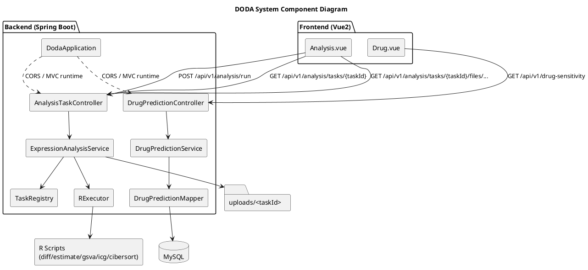
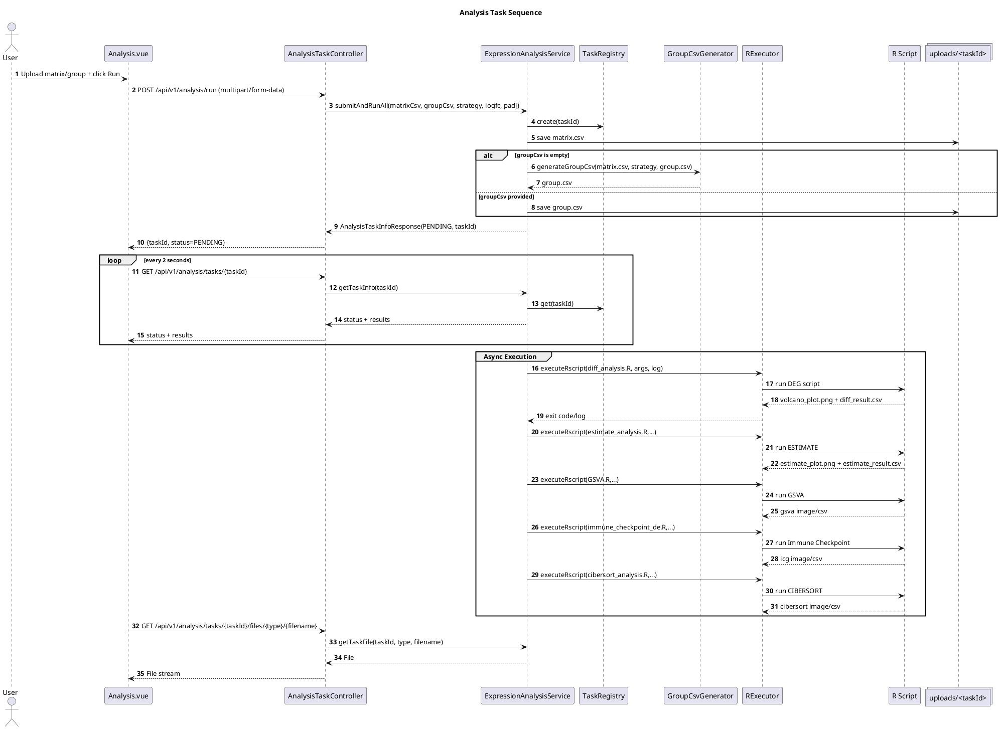
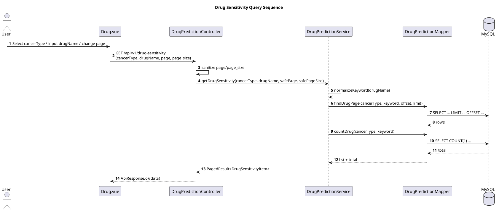
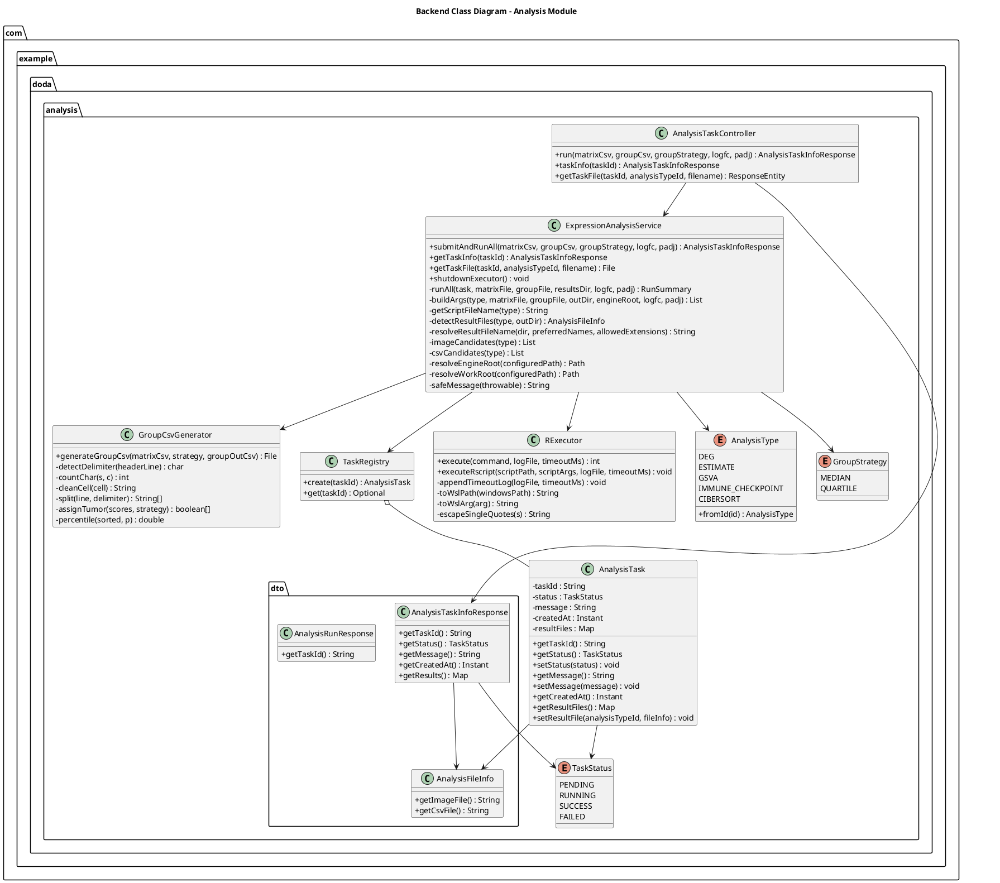
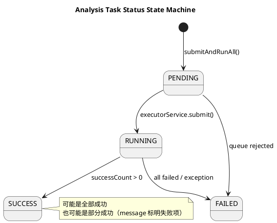

# PlantText UML 代码（DODA）

以下每段代码都可单独复制到 PlantText（[https://www.planttext.com/](https://www.planttext.com/)）直接生成 UML 图。

---

## 1) 系统分层组件图



---

## 2) 分析任务时序图（前端到 R 执行）



---

## 3) 药敏查询时序图



---

## 4) 后端类图（分析模块）



---

## 5) 后端类图（药敏模块 + 通用实体）

```plantuml
@startuml
title Backend Class Diagram - Drug Module
skinparam classAttributeIconSize 0
skinparam shadowing false

package "com.example.doda.controller" {
  class DrugPredictionController {
    +getDrugPredictions(cancerType, drugName) : List
    +getDrugSensitivity(cancerType, drugName, page, pageSize) : ApiResponse
  }
}

package "com.example.doda.service" {
  class DrugPredictionService {
    +getPredictions(cancerType, drugName) : List
    +getDrugSensitivity(cancerType, drugName, page, pageSize) : PagedResult
    -normalizeKeyword(drugName) : String
  }
}

package "com.example.doda.mapper" {
  interface DrugPredictionMapper {
    +findDrugPage(cancerType, drugName, offset, limit) : List
    +countDrug(cancerType, drugName) : long
    +findDrug(cancerType, drugName) : List
  }
}

package "com.example.doda.entity" {
  class ApiResponse~T~ {
    +ok(data) : ApiResponse
    +getCode() : int
    +getMessage() : String
    +getData() : T
  }
  class PagedResult~T~ {
    +getItems() : List
    +getTotal() : long
    +getPage() : int
    +getPageSize() : int
  }
  class DrugPrediction {
    +getSampleId() : String
    +setSampleId(sampleId) : void
    +getDrugName() : String
    +setDrugName(drugName) : void
    +getSensitivityScore() : float
    +setSensitivityScore(score) : void
    +getCancerType() : String
    +setCancerType(cancerType) : void
  }
  class DrugSensitivityItem {
    +getSampleId() : String
    +getDrugName() : String
    +getSensitivityScore() : float
    +getCancerType() : String
    +getDataSource() : String
  }
}

database "MySQL (drug_predictions)" as DB

DrugPredictionController --> DrugPredictionService
DrugPredictionService --> DrugPredictionMapper
DrugPredictionService --> DrugPrediction
DrugPredictionService --> DrugSensitivityItem
DrugPredictionController --> ApiResponse
DrugPredictionController --> PagedResult
DrugPredictionMapper --> DB
@enduml
```

---

## 6) 任务状态机图



